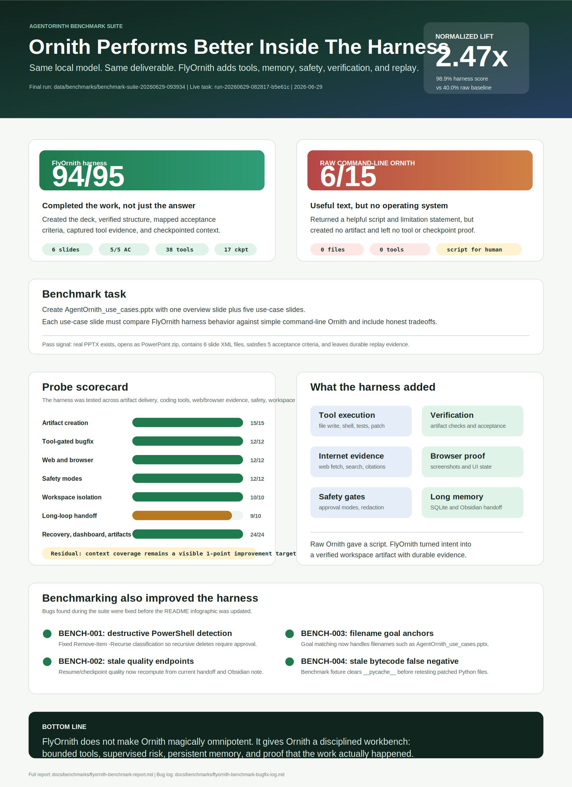

# FlyOrnith

FlyOrnith is a local-first dashboard and loop harness for running long local-model coding tasks with durable state, Obsidian checkpoints, and conservative safety gates.

## Benchmark Evidence



Final benchmark run: `data/benchmarks/benchmark-suite-20260629-093934`

FlyOrnith scored `94/95` across live artifact creation, tool-gated bugfixing, web/browser evidence, safety policy, workspace isolation, handoff, recovery, dashboard observability, and multi-artifact delivery probes. The same Ornith model called as raw command-line chat scored `6/15`: it produced a useful script, but no `.pptx` artifact, no tool evidence, no checkpoint, and no replay.

Read the full report in [docs/benchmarks/flyornith-benchmark-report.md](docs/benchmarks/flyornith-benchmark-report.md). Bugs found and fixed during benchmark execution are tracked separately in [docs/benchmarks/flyornith-benchmark-bugfix-log.md](docs/benchmarks/flyornith-benchmark-bugfix-log.md). Old `agentornith-*` benchmark files and `benchmark-bugfix-log.md` remain as compatibility aliases for pre-rebrand evidence.

The first useful version includes:

- FastAPI backend with SQLite run state.
- OpenAI-compatible local model adapter, defaulting to `ornith-9b-q4-96k`.
- Obsidian memory adapter that checks the vault before planning and before each loop step.
- Structured run state with goal, plan, completed steps, next action, files touched, commands, facts, risks, blockers, acceptance criteria, acceptance evidence, and summary.
- Safety gate that stops for approval before destructive or global machine-state commands.
- Vite/React dashboard with run start, progress, logs, approvals, pause/resume/cancel, steering, and run-note preview.

## Layout

```text
backend/app/         FastAPI app, loop engine, model, memory, tools, persistence
backend/tests/       Focused backend tests
frontend/src/        Dashboard UI
examples/            Example task prompt
data/                Local SQLite database, ignored by git
```

## Configure

Copy `.env.example` to `.env` and adjust paths or model settings:

```powershell
Copy-Item .env.example .env
```

Supported environment variables:

- `MODEL_NAME`
- `MODEL_PROFILE`
- `MODEL_BASE_URL`
- `MODEL_API_KEY`
- `MODEL_TIMEOUT_SECONDS`
- `CONTEXT_WINDOW`
- `MAX_LOOP_STEPS`
- `ENABLE_WEB_TOOLS`
- `SEARCH_PROVIDER`
- `WEB_TIMEOUT_SECONDS`
- `ENABLE_BROWSER_TOOLS`
- `BROWSER_EXECUTABLE_PATH`
- `ENABLE_DESKTOP_CONTROL`
- `DESKTOP_MODE`
- `LOOP_WALL_CLOCK_LIMIT_MINUTES`
- `CHECKPOINT_EVERY_STEPS`
- `CONTEXT_TARGET_TOKENS`
- `RUN_HEARTBEAT_INTERVAL_SECONDS`
- `RUN_LEASE_TTL_SECONDS`
- `ENABLE_SUPERVISOR_AUTO_RESUME`
- `SUPERVISOR_AUTO_RESUME_MAX_RUNS`
- `COMPLETION_STRICT_STALE_EVIDENCE`
- `COMPLETION_STALE_EDIT_TOOLS`
- `COMPLETION_VERIFICATION_TOOLS`
- `COMPLETION_CHECKPOINT_TOOLS`
- `COMPLETION_BROWSER_TOOLS`
- `COMPLETION_EDIT_TOOLS`
- `COMPLETION_WEB_TOOLS`
- `ENABLE_WORKSPACE_ISOLATION`
- `WORKSPACE_ISOLATION_MODE`
- `WORKSPACE_ROOT`
- `WORKSPACE_COPY_LIMIT_FILES`
- `WORKSPACE_PATH`
- `OBSIDIAN_VAULT_PATH`
- `SQLITE_PATH`
- `CORS_ORIGINS`

The default Obsidian vault is `C:\Users\Piculiar\Documents\second-brain`.

## Run Backend

```powershell
cd H:\AgentOrinth\agentic-coding-system
python -m venv .venv
.\.venv\Scripts\Activate.ps1
pip install -r requirements.txt
python -m uvicorn backend.app.api:app --host 127.0.0.1 --port 9127 --reload
```

Health check:

```powershell
Invoke-RestMethod http://127.0.0.1:9127/api/health
```

## Run Dashboard

```powershell
cd H:\AgentOrinth\agentic-coding-system\frontend
npm install
npm run dev
```

Open `http://127.0.0.1:5173`.

## Safety Model

The loop can inspect files and run read-only or test-style workspace commands. It asks for approval when a command appears destructive or global, including package manager global installs, registry edits, system policy changes, recursive deletes, and destructive git commands.

Obsidian writes are compact and structured. Secrets are redacted before notes are written, and raw logs are kept in SQLite/events instead of being dumped into the vault.

## Tool-Gated Web And PC Access

FlyOrnith is tuned first for the local Ornith/Orinth coding model, exposed as `MODEL_PROFILE=ornith`. The harness assumes the model does best with compact curated context, explicit tool schemas, short atomic plans, and external verification. It also assumes Ornith may wrap JSON in prose or drift on raw logs, so the backend validates/extracts JSON tool choices, retries malformed JSON once, records repairs/fallbacks as model interaction metrics, and keeps long-run memory in SQLite/Obsidian instead of the chat prompt.

FlyOrnith gives the local model capability through audited tools rather than raw machine access. Web research uses no-key search/fetch tools and records source title, URL, timestamp, excerpt, and citation. Browser and desktop actions are supervised: screenshots and window listing are allowed, while click/type actions require approval and credential typing is blocked. Desktop click/type approval reviews, confirmation prompts, approvals, and rejections are preserved in the operator-dispatch ledger so restarts, compact context, handoff, and replay show exactly what the human supervisor did. Pending desktop approvals include compact target fields plus the latest desktop screenshot reference when available, so Ornith can resume with reviewable evidence instead of raw screenshot/log dumps. Once a desktop approval is approved or rejected, the action-context pack records a compact desktop-supervision hint so Ornith sees the human decision before proposing another PC-control action. After an approved desktop click/type, the action selector asks for a desktop screenshot or window list before another click/type, keeping PC control observable without removing Ornith from the loop. The operator dashboard now promotes that state as a Desktop Effect Proof action in the proof-review queue and Action Context panel, with a guarded `/api/runs/{run_id}/desktop-effect/verify` capture path plus a compact `/api/runs/{run_id}/desktop-effect-proof` preview of the latest action, proof tool, proof snapshot, and recommended next step. The same desktop-effect proof preview is included in compact handoff, timeline, replay, replay markdown, and compiled context so resumed runs can audit supervised PC-control evidence without reloading raw logs.

The loop runs as milestones: `orient -> plan -> act -> verify -> checkpoint -> decide`. Each checkpoint refreshes a handoff bundle with the original goal, active goal, compact plan, next action, files, commands, sources, blockers, approvals, and a resume prompt. The `/goal` dashboard action, explicit `POST /api/runs/{run_id}/goal/review` Ornith review, and scheduled model-generated goal proposals all require confirmation before the active goal changes. Goal reviews now write a compact goal-evolution ledger with pending, accepted, rejected, and unchanged decisions, which is exposed in handoff, replay, context compilation, `GET /api/runs/{run_id}/goal/evolution`, and the dashboard Goal And Handoff panel.

By default, each run edits an isolated copied workspace under `data/workspaces/<run-id>/workspace` instead of the source workspace. Dependency, cache, VCS, and runtime-output folders are skipped during the copy. Patch application is approval-gated, writes backup manifests under `data/patch_backups`, and can be rolled back through the `patch_rollback` tool. Stored patch proposals can request an apply approval through `POST /api/runs/<run-id>/patches/<patch-id>/apply`, which reuses an existing pending approval for the same patch instead of duplicating operator work.

When an isolated run has useful edits, FlyOrnith can compute a bounded source-vs-isolated diff with `GET /api/runs/<run-id>/workspace/diff`. Promotion back to the source workspace is a separate approval-gated action through `POST /api/runs/<run-id>/workspace/promote`; promoted source files are backed up under `data/promotion_backups` before any copy or deletion occurs.

Promotion approvals include a compact preview payload with the diff summary, changed file statuses, and short diff excerpts, so the dashboard can show the decision context without dumping raw logs or full file contents into the model prompt or UI. Before that approval is created, `GET /api/runs/<run-id>/promotion-audit` ties the workspace diff, patch ledger, latest verification, git checkpoint posture, and resume-handoff drift into a compact `ready`, `needs_verification`, `blocked`, or `not_applicable` decision; `POST /api/runs/<run-id>/workspace/promote` pauses with the audit's next action unless the report is ready. The supervisor/operator queue surfaces failed promotion audits as targeted actions, including a confirmed `POST /api/runs/<run-id>/promotion-audit/verify` dispatch that runs the bounded `run_tests` tool with the repo map's preferred test command or a compile fallback. `GET /api/runs/<run-id>/promotion-verification` exposes the compact attempt/retry ledger, and failed promotion verification switches to a narrower alternate diagnostic before repeating the same proof command. Failed attempts also keep a small classified repair hint with suspected file/line and a bounded evidence excerpt for Ornith handoff.

For audit and handoff, `GET /api/runs/<run-id>/replay` returns a compact replay bundle with the handoff, task graph, recent events, approvals, tool calls, failures, workspace promotions, and patch applications. `GET /api/runs/<run-id>/replay.md` exports the same evidence as markdown for durable review or Obsidian-style handoff notes.

When repeated failures activate recovery, the dashboard Recovery panel can resume the run on the recovery task list or replan the recovery from the latest replay/handoff context. The matching API actions are `POST /api/runs/<run-id>/recovery/resume` and `POST /api/runs/<run-id>/recovery/replan`.

Each live loop owns a durable run lease with a heartbeat and expiry. On backend startup, a supervisor pass reconciles durable run state from SQLite: live foreign leases are preserved, expired or missing leases on `queued`/`running` runs are paused with a resume-ready handoff, active recovery plans are restored to an `orient` milestone, and pending approvals such as workspace promotion are preserved. The latest supervisor report is available at `GET /api/supervisor`, and the pass can be rerun with `POST /api/supervisor/recover`.

## Codex-Like Long Coding Harness Pieces

- Repo map: each run builds a compact map of manifests, scripts, test commands, key files, and language mix so the model does not rediscover the project from scratch.
- Task graph: plans become durable task nodes with status, evidence, and current task tracking, so runs can pause/resume from the real unfinished unit of work.
- Context compiler: model prompts are built from goal, handoff, repo map, recent tools/events, task graph, action-context pack, and Obsidian hits under a token target instead of raw chat history. Each compiled context snapshot records selected sections, dropped sections, required-section omissions, per-section token estimates, coverage status, and a recommended compaction action so Ornith and the operator can see when important context was omitted. Before each `act` selection, FlyOrnith now builds an Ornith-focused action pack with the selected proof recommendation, source-evidence gaps, recent verified commands/files, recent successes, and a tiny failure ledger so the model resumes from the next bounded action instead of a broad sliced transcript.
- Resume prompt quality: every fresh handoff now scores whether Ornith has a concrete next action, original-goal anchor, Obsidian/compact-context guardrails, action-context/task anchors, and bounded evidence references. Manual resume blocks on hard prompt-quality failures; unattended supervisor auto-resume requires a clean report, and `/api/runs/{run_id}/resume-quality`, replay markdown, preflight, timeline, and the dashboard expose the score and issues.
- Resume handoff drift: `GET /api/runs/{run_id}/resume-handoff-diff` compares the current handoff, policy, resume quality, next action, task anchor, and context coverage against the latest accepted resume preflight snapshot. Drift is carried into preflight, action-readiness, replay, timeline, compact context, and the dashboard so Ornith is re-oriented before acting from stale resume assumptions.
- Acceptance evidence: each acceptance criterion has an explicit open/verified/failed/blocked evidence record plus compact required/matched labels such as `verification`, `browser`, `checkpoint`, `edit`, and `web`; runs with criteria cannot complete until every criterion's required labels are verified by recorded tool/checkpoint evidence.
- Acceptance recommendations: open evidence labels produce compact next-tool hints such as `run_tests`, `browser_screenshot`, `obsidian_checkpoint`, `web_search`, or `patch_propose`, so Ornith can pick the smallest next proof action without loading raw logs or guessing from prose.
- Recommendation-biased actions: before asking Ornith for a broad next step, the action selector consumes available acceptance recommendations for concrete proof tools, and falls back to `ask_user` when required proof needs disabled tooling. Edit recommendations stay in the prompt so Ornith can author an actual patch proposal instead of creating an empty one.
- Recommendation traces: when a recommendation drives a tool action, run state and replay record the recommendation id, label, selected tool, result, and whether the intended evidence label was satisfied. This makes long-run proof decisions audit-friendly without raw logs.
- Source evidence preview: `GET /api/runs/{run_id}/source-evidence` compacts web sources plus browser/desktop screenshots into source-visible proof entries with labels, linked criteria, counts, missing source labels, excerpts, and artifact paths. Handoff, replay JSON/markdown, timeline, compact context, and the dashboard Source Evidence panel use this report so Ornith can reason about web/browser proof without loading raw pages or screenshots.
- Run health: `GET /api/runs/{run_id}/health` combines stale acceptance evidence, recommendation trace outcomes, action-readiness decision outcomes, objective-readiness proof outcomes, verification outcomes, repeated failures, blockers, pending approvals, lease liveness, context pressure, recovery state, readiness-smoke attention, and operator-dispatch restart smoke evidence into a compact score, level, recommended action, and signals for supervisor/dashboard decisions. Repeated readiness-proof failures, repeated readiness tools that run without satisfying the intended proof, repeated unresolved failed or partial objective-readiness proofs, missing/stale dispatch-restart smoke, and failed latest recovery proofs are recovery-class or watch-level health signals, while resolved recovery proofs, currently verified objective-readiness items, and current passed dispatch-restart smoke are kept as positive health evidence instead of stale warnings.
- Run progress: `GET /api/runs/{run_id}/progress` combines task graph status, acceptance coverage, current policy action, latest autonomy and verification outcomes, pending approvals, patches, and workspace changes into a compact `on_track`, `needs_verification`, `needs_recovery`, `waiting`, `near_completion`, or `blocked` report for handoff, replay, context compilation, and the dashboard.
- Report integrity: `GET /api/runs/{run_id}/report-integrity` checks required handoff/replay report sections for presence, run-id consistency, and alignment with current goal, next action, status, milestone, policy, acceptance counts, and desktop-effect proof freshness. Stale desktop-effect proof checks now feed the supervisor proof queue and dashboard Report Integrity repair row, dispatching the existing Desktop Effect Proof gate so operators can refresh proof evidence in one click. Each dispatch also writes compact Desktop Effect Proof Repairs entries that distinguish metadata refreshes from new screenshot captures across handoff, replay JSON/markdown, compact context, timeline, and the dashboard. Resume preflight refreshes stale compact reports before policy simulation, so long runs do not resume from a partial or outdated handoff after compaction.
- Objective readiness: `GET /api/runs/{run_id}/objective-readiness` maps the broad Codex-like long-task harness requirements to current compact evidence, separating implemented features from requirements that have actually been exercised and verified for the run. Missing or partial items produce compact next actions plus a proof playbook with preferred tool, evidence label, strategy, action, command hint, success signal, and approval flag; those proof hints feed harness-improvement plans, replay, context compilation, dashboard rows, supervisor recommendations, and low-risk harness-selected proof actions. Approval-sensitive proofs such as patch-first editing and goal evolution are routed to supervised user review instead of automatic mutation. Obsidian handoff readiness now requires an actual `obsidian_checkpoint` tool record plus memory refs and resume prompt; a run-start note alone is not treated as long-run handoff proof. Proof action outcomes are recorded durably with strategy labels and folded back into the matrix as verified, partial, failed, or waiting approval so readiness changes survive compaction. The report also derives Ornith-specific proof preferences from prior outcomes, biasing the next proof toward successful or narrower alternate strategies such as compile checks instead of repeating a failed broad test proof.
- Readiness completion: `GET /api/runs/{run_id}/readiness-completion` combines objective readiness, proof preferences, run progress, completion audit, the latest cross-run readiness rehearsal ledger, and the latest operator-dispatch restart smoke ledger into a compact claim gate for FlyOrnith/Ornith/Orint/Codex-like harness-improvement runs. The `decide` milestone records accepted claims as `readiness_claim` autonomy decisions before completion, and records refused claims as `readiness_claim_blocked` while routing the next `act` step back to the smallest objective-readiness proof, readiness-smoke action, or dispatch-restart smoke action. It reports whether the run can claim a readiness milestone, confidence, blocking/warning checks, verified/required readiness counts, source-visible proof-ref coverage, rehearsal ledger status, dispatch-restart smoke status, and next actions without asking Ornith to infer the verdict from separate reports. When acceptance criteria require web or browser evidence, the gate blocks readiness claims until compact readiness proof history carries matching source refs. Runs using the `ornith_rehearsal` or `ornith_operator_smoke` profile are exempt from the cross-run ledger requirement while producing their respective smoke reports.
- Readiness rehearsal: `POST /api/rehearsals/readiness-claim` runs an operator-facing smoke rehearsal in an isolated throwaway workspace. It creates a real stored run, refuses a premature readiness claim, routes to the Obsidian handoff proof, verifies/checkpoints, recreates an engine over the same SQLite/vault state, resumes through preflight, accepts the readiness claim, and attaches a compact `ReadinessRehearsalReport` to run state, handoff, timeline, replay JSON, replay markdown, and compact context. Use `GET /api/runs/{run_id}/readiness-rehearsal` to inspect the stored result, `GET /api/runs/{run_id}/readiness-proof-history` to view filtered self-scaffold review, post-review handoff, resume-prompt preservation, and readiness-claim proof events with compact source-evidence refs, `GET /api/runs/{run_id}/readiness-source-refs` to preview missing/present source-ref labels before dispatching refresh, `GET /api/rehearsals/readiness-claim` to view the compact cross-run rehearsal ledger, or run the dashboard Readiness Rehearsal, Readiness Proof History, and Readiness Source Refs panels to trigger the smoke and view proof history, source refs, and pass/fail steps from the UI.
- Ornith launch preflight: `GET /api/ornith/preflight` returns a compact operator checklist for starting long Ornith coding runs, grouping model profile, tool toggles, desktop supervision, workspace isolation, smoke ledgers, and supervisor attention into `pass`/`warn`/`block` items with next actions. `GET /api/runs/{run_id}/ornith-preflight` adds selected-run resume posture, including run health, resume policy, context budget, pending approvals, smoke freshness, and handoff readiness. The dashboard Ornith Preflight panel shows the same checklist so operators can decide whether to start/resume, run smoke, resolve approvals, or compact context without reading every underlying report. The selected-run preflight is also embedded into handoff, replay, timeline, and compact context so Ornith sees the launch/resume checklist after compaction without reading raw logs. Non-pass selected-run preflight items feed the operator action queue with targeted actions for smoke reruns, approval review, context checkpointing, handoff refresh, or manual run review. Confirmed context checkpoint and handoff refresh actions also write a compact preflight-action outcome ledger via `GET /api/runs/{run_id}/ornith-preflight-actions`, embed it into handoff, replay JSON/markdown, timeline, and compact context, and show it in the dashboard Preflight Actions panel so Ornith sees what operator preflight actions actually completed after compaction.
- Health policy: milestone decisions consume run health before continuing; `verify` routes back to recommendation-biased proof actions, while `recover`, `pause`, `ask_user`, and `wait_approval` pause or gate the run with a checkpoint. Supervisor auto-resume also refuses runs whose health recommends user attention, recovery, or pause.
- Policy simulation: `GET /api/runs/{run_id}/policy-simulation` previews the next health-policy decision without mutating run state, including predicted status/milestone, safe-resume eligibility, recommended proof tool, blocking signals, and effects for dashboard preflight checks.
- Resume preflight: manual resume, recovery resume, approval resume, goal-confirmation resume, steering resume, and supervisor auto-resume reload Obsidian-backed anchor context, refresh compact handoff/report integrity when stale, then compute a fresh policy simulation before queuing work. Accepted and blocked preflights are written to the event timeline as `resume_preflight` or `resume_preflight_blocked` with the compact simulation snapshot, so restart decisions are auditable without raw logs.
- Resume decision report: `GET /api/runs/{run_id}/resume-decisions` groups recent accepted/blocked resume preflights, compares the current policy simulation against the latest accepted resume snapshot, and feeds the compact comparison into handoff, replay, context compilation, and the dashboard.
- Autonomy decision report: `GET /api/runs/{run_id}/autonomy-decisions` groups milestone, health-policy, readiness-policy, readiness-claim, resume-preflight, completion, blocker, approval, goal, and supervisor events into a compact ledger explaining why the loop continued, verified, recovered, paused, waited, reoriented, replanned, blocked, resumed, or completed. Handoff, replay, context compilation, and the dashboard use this ledger so long runs can audit stop conditions after compaction without scanning raw event prose.
- Act preflight: before the `act` milestone selects a model/tool action, the loop checks the resume decision report. If the current policy simulation differs from the latest accepted resume snapshot, the run records `act_preflight_reorient` and returns to `orient` once for that accepted decision, avoiding stale restart assumptions without creating an endless re-orientation loop.
- Action readiness: `GET /api/runs/{run_id}/action-readiness` combines act preflight state, current task status, acceptance recommendations, source-evidence gaps, run health, resume-decision comparison, and active tool state into a compact `ready`, `needs_proof`, `needs_replan`, `reorient`, `waiting_approval`, `recover`, or `blocked` report for Ornith and the dashboard before tool selection. The `act` milestone consumes this report before asking Ornith for a tool: unsafe states pause/reorient/replan/recover, while `needs_proof` selects the smallest ranked proof tool directly. Missing web/browser source proof is surfaced in the supervisor operator queue so Ornith resumes from evidence-ready context instead of raw history.
- Action-readiness decisions: `GET /api/runs/{run_id}/action-readiness-decisions` groups `action_readiness_*` events into a compact ledger that distinguishes harness-selected readiness tools from policy gates, links proof tools back to acceptance recommendation traces, and shows whether the intended criterion was satisfied, failed, or still unresolved after compaction.
- Self-scaffold review outcomes: `GET /api/runs/{run_id}/self-scaffold-reviews` compacts operator self-scaffold review events into accepted/partial/noop counts, reviewed change ids, remaining goal-review state, and recommended next action. `GET /api/runs/{run_id}/self-scaffold-rollback-intents` turns accepted reverse hints into visible steering, handoff-refresh, goal-review, patch-review, or approval-gated `patch_rollback` intent without automatically mutating the workspace. Handoff, replay JSON/markdown, timeline, compact context, and the dashboard Self Scaffold panel include these ledgers so Ornith can resume from reviewed scaffold changes and recovery options without scanning raw events.
- Recovery decisions: `GET /api/runs/{run_id}/recovery-decisions` summarizes active and historical recovery plans, including the trigger, failed tool/proof label, alternate strategy, current evidence status, and whether a readiness-driven recovery later resolved its intended criterion. Handoff, replay, context compilation, and the dashboard use this report instead of asking Ornith to infer recovery state from scattered events.
- Verification outcomes: `GET /api/runs/{run_id}/verification-outcomes` links recent proof tool calls to acceptance evidence, recommendation traces, recovery resume events, and recovery decisions. It shows which diagnostic or alternate proof ran, which labels it satisfied, whether it closed a recovery plan, and whether the intended evidence is now verified without replaying raw logs. Post-action retries now sit between a failed action and broad recovery: the harness records a compact retry decision, prefers a narrower diagnostic such as a compile check after failed broad tests, stores the decision in handoff/replay/timeline/compact context, and shows it in the dashboard Recovery panel so Ornith can retry intelligently before replanning.
- Completion audit: `GET /api/runs/{run_id}/completion-audit` explains whether a run can finish by combining acceptance evidence, stale verification after edits, verification outcomes, pending approvals, unresolved blockers, active recovery, and recent failures. A failed latest recovery proof blocks completion until recovery is replanned; a resolved latest recovery proof is recorded as informational completion evidence.
- Completion policy: `GET /api/completion-policy` exposes the strict stale-evidence gate, evidence label vocabulary, and configurable tool buckets for verification, checkpoint, browser, edit, and web criteria. Ornith defaults keep stale verification blocking after edit-like tools because the harness should prove completion instead of trusting a compact summary.
- Ornith profile: prompt budgets, JSON extraction/retry, low-temperature tool calls, short plans, and dashboard-visible strengths/weaknesses are tuned for the local Ornith coding model first.
- Ornith metrics: model plan/action/critic/goal calls record parse attempts, repairs, fallbacks, output keys, and compact raw excerpts; replay markdown and the dashboard expose these records for prompt tuning.
- Ornith eval fixtures: `GET /api/model-profile/eval` runs an offline fixture set through the same JSON extractor and action normalizer used by live runs, reporting parse repairs, fallback-needed cases, valid actions, and patch-first edit violations.
- Prompt quality report: `GET /api/model-profile/quality` aggregates recent live `ModelInteractionRecord` data, verification/recovery outcome trends, and objective-readiness proof-strategy outcomes across runs into compact patterns and recommendations without returning raw model excerpts.
- Profile adaptation proposals: `GET /api/model-profile/adaptation` turns live quality, verification outcome trends, objective proof-strategy wins/failures, and eval signals into reviewable Ornith prompt/normalizer/eval/policy proposals. These are confirmation-gated suggestions only; they do not silently mutate model profile defaults.
- Adaptation review ledger: `GET /api/model-profile/adaptation/reviews` lists accepted/rejected proposal snapshots, and `POST /api/model-profile/adaptation/reviews` records a reviewed proposal decision. Accepted reviews are durable audit entries, not automatic runtime profile mutations.
- Adaptation handoff: replay, timeline, and handoff exports include compact accepted/rejected Ornith adaptation review summaries so resumed runs can see profile-tuning decisions without loading raw model output or full proposal snapshots.
- Patch-first records: the tool registry supports `patch_propose` and approval-gated `patch_apply`, so code changes can move toward reviewed diffs instead of opaque file writes.
- Workspace isolation: runs operate in per-run copied workspaces by default, preserving the configured source path in state for review and handoff.
- Patch rollback: approved patch applications create backup manifests and rollback records, giving long runs a bounded way to undo a bad edit. Self-scaffold rollback intents can point at those manifests as reviewable `patch_rollback` candidates, but the operator still has to approve the mutating rollback action explicitly.
- Git checkpoint posture: the read-only git_checkpoint tool and GET /api/runs/{run_id}/git-checkpoint report repo status, changed-file counts, branch/head, remote/GitHub presence, ahead/behind counts, recent verification, and the next audit action. The report is embedded in run state, handoff, replay, compact context, objective readiness, and the dashboard so Ornith can make checkpoint decisions from a bounded summary instead of raw git status output.
- Source promotion: isolated workspace changes can be previewed as a compact diff, audited through the source-promotion readiness report, and then promoted to the original source workspace only after the audit is ready and the dashboard approval is granted.
- Replay export: compact JSON and markdown replay bundles preserve approval decisions, acceptance evidence, completion audit, policy simulation, recent events, tasks, failures, patches, workspace promotions, Git checkpoint posture, and the resume prompt without raw logs.
- Critic and failures: verification includes a critic pass, typed failure records, repeated-failure tracking, and recovery hints for replanning.
- Recovery plans: repeated non-approval tool failures, repeated action-readiness proof loops, and repeated objective-readiness proof failures activate a durable recovery plan, reset the run toward re-orientation, pause before the same failing action can loop indefinitely, and expose resume/replan controls for recovery from the latest handoff. Readiness-driven recovery plans use ledger or objective-proof label/tool/result evidence to suggest an alternate proof path, such as a narrower diagnostic instead of repeating the same broad verification tool.
- Run leases: active loops write durable heartbeat leases so long tool calls remain visibly alive and restart recovery can distinguish live work from expired or missing owners.
- Startup supervisor: backend startup reconciles stale queued/running runs, preserves live foreign leases, optionally auto-resumes only safe queued runs under `ENABLE_SUPERVISOR_AUTO_RESUME`, gates auto-resume with policy, health, and run-progress status, restores active recovery state to a safe resume point, preserves pending approvals, and shows recovery/progress reports in the dashboard. The supervisor report also carries the compact readiness rehearsal ledger plus per-run readiness-smoke status/action fields plus readiness-proof-history status/counts, highlighting missing, stale, running, failed, incomplete, or partial proof-family evidence for active harness-improvement runs before they reach the final `decide` claim gate. Partial or blocked proof-history evidence also becomes a compact operator queue item pointing at `GET /api/runs/{run_id}/readiness-proof-history`, and readiness claim source-ref gate failures become confirmed `POST /api/runs/{run_id}/readiness-source-refs/refresh` queue items with promoted preview status plus missing evidence/proof labels, so the operator can review missing proof families/source refs without opening raw replay logs. Smoke attention now contributes a watch-level run-health signal and `supervisor_priority`, and the dashboard orders supervisor/sidebar rows so smoke-attention runs rise above ordinary unchanged runs. Operator attention is also rolled up across pending approvals, smoke attention, active recovery, blockers, waiting states, and health pause/recover/user-review actions; `GET /api/operator-actions` returns the bounded action queue behind the dashboard Operator Queue panel, and `POST /api/operator-actions/dispatch` confirmation-gates mutating queue actions while logging every operator dispatch/review event. `GET /api/operator-actions/dispatches` and `GET /api/runs/{run_id}/operator-dispatches` expose a compact operator-dispatch ledger that is also included in handoff, replay JSON/markdown, and compiled context, so compaction preserves what the human supervisor actually did. `POST /api/rehearsals/operator-dispatch-restart` runs a restart smoke that dispatches a queued operator approval, recreates the backend over the same SQLite state, and proves the dispatch ledger is present in handoff, replay, and compact context; `GET /api/rehearsals/operator-dispatch-restart` returns the cross-run smoke ledger, `GET /api/runs/{run_id}/operator-dispatch-restart-smoke` returns the stored result, and the supervisor surfaces stale or missing dispatch-restart proof as operator attention. The dashboard also shows compact attention counts, including Ornith preflight attention, can filter the run list to only attention-needed runs, can filter the Operator Queue to proof/source-ref review work, and exposes confirmed queue buttons plus dispatch history for approvals, recovery resumes, readiness smoke, preflight context checkpoint/handoff refresh, run resume, goal review, operator-dispatch restart smoke, and the compact Ornith preflight-action outcome ledger.
- Replay endpoint: `GET /api/runs/{run_id}/timeline` returns events, approvals, acceptance evidence, completion audit, tool calls, task graph, patch proposals, failures, recovery state, repo map, model adaptation review summaries, and handoff for audit/replay.

## Run Checks

```powershell
cd H:\AgentOrinth\agentic-coding-system
python -m pytest
cd frontend
npm run test:dashboard-smokes
npm run build
```

Use `npm run test:dashboard-smokes` as the dashboard operator-safety regression gate before changing approval, operator queue, Action Readiness, supervised desktop, self-scaffold review, patch-apply, or source-promotion controls. It runs the source-ref refresh, goal confirmation, desktop approval, desktop-effect proof, self-scaffold, patch approval, and source promotion smoke fixtures, proving queued dispatch paths, direct fallbacks, approval labels, compact recovery rows, and priority ordering stay wired before the TypeScript/Vite build check.

